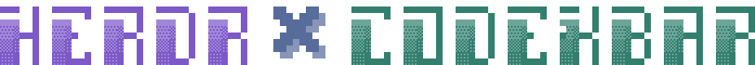
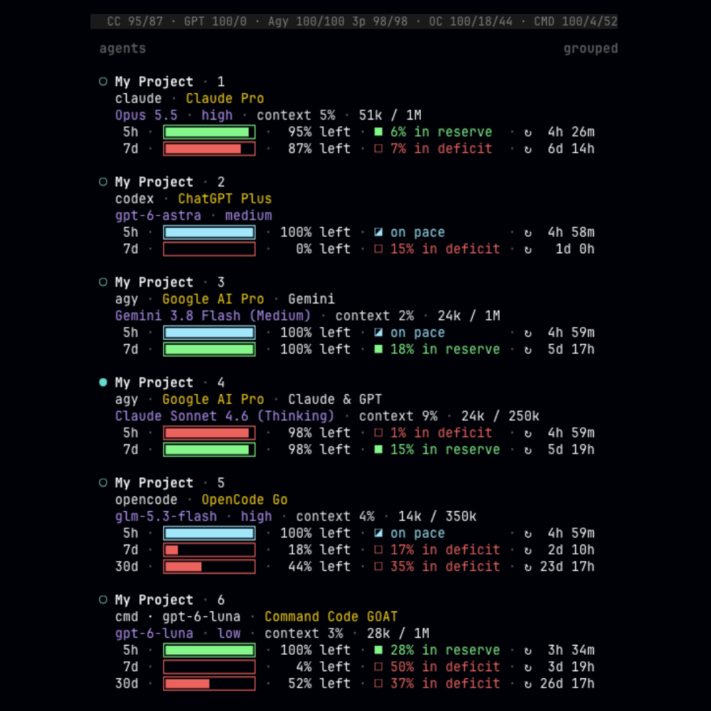

<div align="center">
  <picture>
    <source media="(prefers-color-scheme: dark)" srcset="docs/logo-dark.svg">
    <source media="(prefers-color-scheme: light)" srcset="docs/logo-light.svg">
    
  </picture>
</div>

<div align="center">
  <h3>Subscription quota for your coding agents, right where you run them</h3>
</div>

<div align="center">
  <a href="LICENSE"></a>
  
  <a href="https://github.com/Argon-Sky/herdr-codexbar/releases/latest"></a>
  <a href="https://github.com/Argon-Sky/homebrew-tap"></a>
</div>

<br>

herdr-codexbar puts [CodexBar](https://github.com/steipete/CodexBar)'s usage data into [Herdr](https://herdr.dev): under each agent in the sidebar, the plan it is billing, its model and context, and how much of each quota window is left. Not affiliated with Herdr, CodexBar or any provider.

<p align="center"></p>

## Why this one

- **It never touches your credentials.** CodexBar already signs in to your providers and reads their quota. herdr-codexbar only asks the CodexBar CLI for the numbers, so there are no tokens, cookies or API keys to hand over.
- **Quota follows the subscription, not the agent.** Each pane shows the quota of the provider it is talking to right now. OpenCode switching from OpenCode Go to a Command Code model moves the pane to Command Code's quota.
- **Antigravity's two pools.** Gemini models and third-party models (Claude, GPT) have separate quotas in Antigravity. The pane shows the pool of the model it is using.
- **Pace, not just percent.** Every window says whether you are ahead of an even burn (■ in reserve), on pace (◪) or behind (□ in deficit), and when it resets.
- **A setup you can review and undo.** `setup --dry-run` shows the exact diff, every edited file is backed up, and `uninstall` puts things back.

## Coverage

| Harness ╲ Subscription | Claude Pro | ChatGPT Plus | SuperGrok | Google AI Pro | OpenCode Go | Command Code GOAT | Copilot Pro |
| --- | --- | --- | --- | --- | --- | --- | --- |
| [Claude Code](https://claude.com/claude-code) | ✅ | ❌ | ❌ | ❌ | ❔ | ❔ | ❌ |
| [Codex](https://github.com/openai/codex) | ❌ | ✅ | ❔ | ❌ | ❔ | ❔ | ❌ |
| [Grok Build](https://x.ai/cli) | ❌ | ❌ | ✅ | ❌ | ❌ | ❌ | ❌ |
| [Antigravity CLI](https://antigravity.google) | ❌ | ❌ | ❌ | ✅ | ❌ | ❌ | ❌ |
| [OpenCode](https://opencode.ai) | ⚠️ | ✅ | ✅ | ⚠️ | ✅ | ✅ | ❔ |
| [Command Code](https://commandcode.ai) | ❌ | ❌ | ❌ | ❌ | ❌ | ✅ | ❌ |
| [GitHub Copilot CLI](https://github.com/features/copilot/cli) | ❌ | ❌ | ❔ | ❌ | ❔ | ❔ | ✅ |
| [Pi](https://github.com/earendil-works/pi) | ⚠️ | ✅ | ✅ | ⚠️ | ✅ | ❔ | ✅ |
| [Oh My Pi](https://github.com/can1357/oh-my-pi) | ⚠️ | ✅ | ✅ | ⚠️ | ✅ | ❔ | ✅ |
| [Prime Agent](https://github.com/PrimeIntellect-ai/prime-agent) | ⚠️ | ✅ | ✅ | ⚠️ | ✅ | ❔ | ✅ |
| [Kilo CLI](https://github.com/Kilo-Org/kilocode) | ⚠️ | ✅ | ✅ | ⚠️ | ✅ | ❔ | ❔ |

- ✅ Integrated in herdr-codexbar and tested
- ❔ Not verified
- ❌ Not possible, as far as we know
- ⚠️ Technically possible, but against the provider's terms; not supported

Notes:

- Codex needs `hooks = true` under `[features]` in `~/.codex/config.toml`, and must be started with `--no-daemon`. Its quota appears after the first message.
- Claude Code and Codex reach only some OpenCode Go models: MiniMax and Qwen in Claude Code, GPT Luna, Grok and Muse Spark in Codex. Translating proxies such as LiteLLM are not supported.
- X Premium+ works like SuperGrok, and higher tiers (Claude Max, ChatGPT Pro and similar) like the plans above.

## Requirements

- macOS 14 or newer.
- [Herdr](https://herdr.dev) 0.9.1 or newer: `brew install herdr`. Install Herdr's integration for each agent you use, for example `herdr integration install claude`.
- [CodexBar](https://github.com/steipete/CodexBar): `brew install --cask codexbar`. Open it once, sign in to your providers and turn on the ones you want in its settings. The CodexBar CLI (Preferences → Advanced → Install CLI) is optional: herdr-codexbar falls back to the CLI inside the app.
- [Fira Code](https://github.com/tonsky/FiraCode) 6 or newer as your terminal font, for the progress bars: `brew install --cask font-fira-code`. Any [Nerd Font](https://www.nerdfonts.com) 3 or newer works too.
- One or more of the agents under [Coverage](#coverage).

## Install

```sh
brew install argon-sky/tap/herdr-codexbar
herdr-codexbar check            # prerequisites, and what setup would change
herdr-codexbar setup --dry-run  # the exact diff, nothing written
herdr-codexbar setup
```

`setup` wires each agent it finds, adds the sidebar rows to `~/.config/herdr/config.toml`, and starts the poller with `brew services`. Restart running agents afterwards; Codex asks you to approve its new hooks on the first start.

It changes only what it needs: comments and other settings stay as they are, and every file it edits is backed up first to `~/.cache/herdr-codexbar/backups`. If an agent already has a status line from another tool, `setup` stops and tells you; `setup --force` replaces it.

## Uninstall

```sh
herdr-codexbar uninstall   # also takes --dry-run
brew uninstall herdr-codexbar
```

`uninstall` removes the wiring, restores the sidebar rows you had before `setup`, stops the poller and clears the rows from open panes.

## Privacy

- Everything stays on your Mac. herdr-codexbar makes no network requests; CodexBar does the fetching.
- It keeps a small snapshot in `~/.cache/herdr-codexbar` (readable only by you) with plan names, percentages and reset times. Account emails, organizations and raw CodexBar output are never stored or logged.
- It reads agent settings to wire them, and each session's own status-line or hook data (model, effort, context) to display it.

## Troubleshooting

Run `herdr-codexbar check` first. It shows what is missing and how to fix it. The poller's own error is in `herdr-codexbar refresh`, and `brew services info herdr-codexbar` shows whether it runs.

- **Bars show as boxes or question marks:** your terminal font is not Fira Code 6+ or a Nerd Font 3+.
- **Rows are cut off:** the sidebar needs 65 columns. `setup` sets it to 70 when you have not set it, and `check` warns when your own width is narrower.
- **Only one Codex pane shows rows:** Codex 0.158 and later run every session in one shared background server by default, and its hooks report as the pane that started it. Start Codex with `--no-daemon`, for example `alias codex="codex --no-daemon"`, and stop the running server with `codex app-server daemon stop`. `check` warns while it runs.
- **An agent shows no rows:** your `[ui.sidebar.agents.rows_by_agent]` has its own layout for that agent, which Herdr uses instead of ours. `check` tells you which.

Still stuck? [Open an issue](https://github.com/Argon-Sky/herdr-codexbar/issues) with the output of `herdr-codexbar check`.

## How provider routing works

Each agent reports the provider ID it is using. herdr-codexbar maps that ID to a CodexBar provider:

| Provider ID | CodexBar quota |
| --- | --- |
| `anthropic` | Claude |
| `openai`, `openai-codex` | Codex |
| `antigravity` | Antigravity, pool by model |
| `opencode-go` | OpenCode Go |
| `commandcode` | Command Code |
| `github-copilot` | Copilot, monthly premium requests |
| `grok`, `xai`, `xai-oauth` | Grok |

Claude Code has no provider setting, so its provider follows `ANTHROPIC_BASE_URL`: unset or `https://api.anthropic.com` is `anthropic`, and `https://opencode.ai/zen/go` is `opencode-go`. Any other endpoint, such as a local proxy, shows model and context only. Codex reports the `model_provider` from its config, so name a custom one `opencode-go` to see OpenCode Go quota.

Other providers, such as OpenCode Zen, have no quota in CodexBar, so the pane shows its model and context only. In OpenCode, Kilo CLI and the Pi family, a custom provider shows a subscription's quota when you name it after the CodexBar provider, for example `commandcode` for a Command Code plan used through its OpenAI-compatible API.

## Roadmap

Ideas, not promises. Upvote or comment on the [roadmap issues](https://github.com/Argon-Sky/herdr-codexbar/issues?q=is%3Aissue+label%3Aroadmap) to move them up.

- Linux, once CodexBar's CLI runs there.
- More agents, next up Cline CLI, Mastra Code and Droid.
- Session tokens and API-equivalent cost.
- Quota for API and credit billing.
- A compact layout for narrow sidebars, if people ask for it.

## Development

```sh
bin/herdr-codexbar check        # runs from the checkout
python3 -m unittest discover -s tests -t .
node --test tests/*.test.js tests/*.test.ts
```
